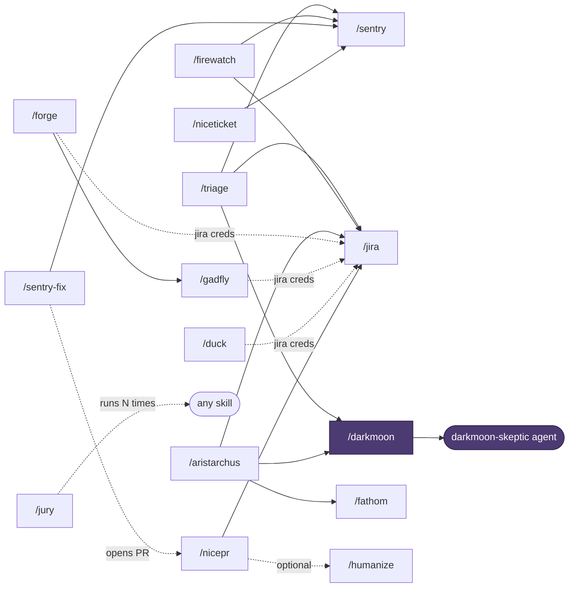

[](https://github.com/sgtlaugh/skills/actions/workflows/test.yml)
[](LICENSE)

# 🌑 skills

```
     ░▒▓ skills ▓▒░
  liar ahead. try grep.
```

Claude Code skills that make the agent prove it.

- **Evidence or nothing:** every verdict cites a grep, a query or a `file:line`, or says `Can't-determine`.
- **Fresh eyes:** reviews run in a separate context, so the author's reasoning can't wave its own work through.

## Quick start

```bash
git clone https://github.com/sgtlaugh/skills.git ~/Github/skills && ~/Github/skills/install.sh
```

- Restart Claude Code and type `/`.
- Re-run `install.sh` after each pull.
- Common usage is in [`CHEATSHEET.md`](CHEATSHEET.md); every flag is in each skill's `SKILL.md`.

## Setup

Most skills work right after install. `install.sh` lists what the rest still need each time it runs, and the tables below say what each thing unlocks.

<details>
<summary>What each skill needs</summary>

| Set up | For | How |
|---|---|---|
| Nothing | `/occam`, `/kiln`, `/fathom`, `/bonfire`, `/solaire`, `/dialectic`, `/darkmoon`, `/jury`, `/velka`, `/humanize`, `/niceticket` | - |
| `gh auth login` | `/aristarchus`, `/nicepr`, `/triage`, `/sentry`, `/sentry-fix`, `/firewatch`; a PR in `/darkmoon`, `/solaire`, `/niceticket` | [gh](https://cli.github.com/) |
| Jira credentials | `/jira`; ticket context in `/nicepr`, `/aristarchus`, `/triage`, `/gadfly`, `/forge`, `/duck`; tickets from `/firewatch` | `jira*` keys below |
| Sentry credentials | `/sentry`, `/sentry-fix`, `/triage`, `/firewatch`; a Sentry issue in `/niceticket` | `sentry*` keys below |
| Datadog, Jenkins, Opsgenie | `/firewatch` alert sources | keys below |
| `services.md` | `/sentry`, `/sentry-fix`, `/triage`, `/firewatch`; the `/aristarchus` mutation check | fill in the template `install.sh` writes |
| `$WORKSPACE` | `/aristarchus`, `/triage`, `/sentry-fix` | `export WORKSPACE=~/code` in your shell profile: the directory holding your clones |
| `voice.md` | `/humanize` in your own voice | your own file |
| `work.json` | reviewers for `/nicepr --create` | `{"reviewers": [...]}` |
| pandoc | document conversion in `/jira`, `/gadfly`, `/forge`, `/dialectic` | [pandoc](https://pandoc.org/) |
| python + pytest | `/bonfire`, `/duck --quack` | [pytest](https://pytest.org/) |

Every skill needs [Claude Code](https://docs.claude.com/en/docs/claude-code); `install.sh` and the API skills need [jq](https://jqlang.github.io/jq/) and curl 7.76+. Linux and macOS, bash 3.2 or newer.

</details>

<details>
<summary>Config files and credential keys</summary>

Up to four files live in `~/.config/claude-skills/`. `install.sh` creates the first two if they're missing, never overwrites them, and backs up anything in its way to `.bak`. Skills that need none of them work right after install.

| File | Created by `install.sh` | Used by | Holds |
|---|---|---|---|
| `credentials.json` | yes (mode 600) | the API skills | API tokens (keys below) |
| `services.md` | yes | `/sentry`, `/sentry-fix`, `/triage`, `/firewatch`, `/aristarchus` | *Your* systems: repos, log search, alert patterns, test commands |
| `voice.md` | no | `/humanize` | *Your* voice for GitHub text |
| `work.json` | no | `/nicepr` | `{"reviewers": [...]}` for `--create` |

- **`credentials.json`** lives elsewhere if `CLAUDE_SKILLS_CREDENTIALS` points there.
- **`services.md`** says which repo each Sentry project lives in, your log search skill, your alert patterns and how to run each repo's tests. It starts as a template whose values read `<your ...>`; skills treat those as missing and ask, so fill in the sections your skills use.
- **`voice.md`** holds how you suggest, push back and approve.
- **`work.json`**'s reviewers are asked to review a PR `/nicepr --create` opens, unless it's a draft.

**`credentials.json` keys**

| Key | Used by | Where to get it |
|---|---|---|
| `datadogPAT` | `/firewatch` | Datadog → Personal Access Tokens |
| `datadogSite` | `/firewatch` | Your Datadog site, e.g. `datadoghq.com` |
| `jenkinsApiToken` | `/firewatch` | Jenkins → your user → Configure → API Token |
| `jenkinsUser` | `/firewatch` | Your Jenkins username |
| `jiraApiToken` | `/jira`, `/gadfly`, `/forge`, `/duck`, `/nicepr`, `/aristarchus`, `/triage`, `/firewatch` | [Atlassian API tokens](https://id.atlassian.com/manage-profile/security/api-tokens) |
| `jiraBaseUrl` | `/jira`, `/gadfly`, `/forge`, `/duck`, `/nicepr`, `/aristarchus`, `/triage`, `/firewatch` | Your Atlassian site, e.g. `https://acme.atlassian.net` |
| `jiraEmail` | `/jira`, `/gadfly`, `/forge`, `/duck`, `/nicepr`, `/aristarchus`, `/triage`, `/firewatch` | Your Atlassian email |
| `opsgenieApiKey` | `/firewatch` | Opsgenie → Settings → API key management |
| `sentryAuthToken` | `/sentry`, `/sentry-fix`, `/triage`, `/firewatch`, `/niceticket` | Sentry → Settings → Auth Tokens (`org:read`, `project:read`, `event:read`) |
| `sentryOrg` | `/sentry`, `/sentry-fix`, `/triage`, `/firewatch`, `/niceticket` | Your Sentry org slug |

Skills that call `/jira` or `/sentry` use these keys through them. Two optional keys: `opsgenieApiBase` for an EU Opsgenie account, `sentryApiBase` for a self-hosted Sentry.

</details>

## The skills

| Skill | What it does |
|---|---|
| **Before you push** | |
| [`/occam`](skills/occam/SKILL.md) | Reviews your change in a fresh context for bugs, leftovers and simplicity |
| [`/aristarchus`](skills/aristarchus/SKILL.md) | Deep PR review: five independent lenses, a mutation check of the tests, findings verified by `/darkmoon` |
| [`/nicepr`](skills/nicepr/SKILL.md) | Short, human PR titles and descriptions from the diff and the ticket |
| [`/niceticket`](skills/niceticket/SKILL.md) | Short, well-formatted Jira bug tickets: only the sections the facts support, code links as permalinks |
| **Checking claims** | |
| [`/darkmoon`](skills/darkmoon/SKILL.md) | An independent skeptic checks the last answer, or claims, against the code |
| [`/solaire`](skills/solaire/SKILL.md) | Run before a research question: seven fixed checks keep the answer grounded |
| **Building and debugging** | |
| [`/bonfire`](skills/bonfire/SKILL.md) | Test-first: watch the test fail, write the least code to pass, refactor when green |
| [`/duck`](skills/duck/SKILL.md) | A sarcastic rubber duck that questions you until you find the bug yourself |
| [`/fathom`](skills/fathom/SKILL.md) | Judges whether a module is deep or shallow, and how to deepen it |
| **Specs and decisions** | |
| [`/gadfly`](skills/gadfly/SKILL.md) | Attacks a tech spec before it's built: gaps, grounding in real code, four lenses |
| [`/forge`](skills/forge/SKILL.md) | Turns a PRD into a grounded spec draft; you decide, `/gadfly` critiques |
| [`/dialectic`](skills/dialectic/SKILL.md) | Argues each option to win, then names the trade-off and what would flip it |
| **Production** | |
| [`/firewatch`](skills/firewatch/SKILL.md) | Investigates an alert: severity first, then logs, Sentry, APM, alert history |
| [`/sentry`](skills/sentry/SKILL.md) | Deep-dives a Sentry issue at the deployed release; checks if a deploy fixed it |
| [`/sentry-fix`](skills/sentry-fix/SKILL.md) | Gates a Sentry issue, reproduces it with a failing test, fixes the root cause on a branch |
| [`/triage`](skills/triage/SKILL.md) | A bug ticket to a proven root cause, a question ticket to an answer per ask |
| [`/jira`](skills/jira/SKILL.md) | Creates, searches and updates Jira tickets; reads Confluence pages |
| **About skills themselves** | |
| [`/kiln`](skills/kiln/SKILL.md) | Lints a SKILL.md for rules that won't bind, contradictions and stale references |
| [`/jury`](skills/jury/SKILL.md) | Runs a skill N times: which findings were consistent and which were luck |
| [`/velka`](skills/velka/SKILL.md) | Mines your past sessions for habits; `--propose` drafts CLAUDE.md edits |
| [`/humanize`](skills/humanize/SKILL.md) | Strips AI writing patterns; gates GitHub text against a house style |

## Example verdict

`/darkmoon --claims` on a repo built to fool a grep (trimmed):

```
## 🌑 darkmoon - judgment on 7 claims

| # | Claim                                 | Verdict         | Evidence                                                     |
|---|---------------------------------------|-----------------|--------------------------------------------------------------|
| 2 | issue_refund is never called          | Refuted ✗       | api.py:1 imports it `as give_back`; api.py:5 calls give_back |
| 3 | handle_chargeback is dead code        | Refuted ✗       | handlers.py:3 getattr(self, f"handle_{event}") reaches it    |
| 4 | The repo never imports pickle         | Upheld ✓        | grep -rniE 'pickle|__import__' → no output                   |
| 6 | The refund endpoint logged no errors  | Can't-determine | needs the production logs; the repo can't show it            |

Verdict: 4 refuted · 0 weak · 2 upheld · 1 can't-determine.
```

## How skills connect

Skills hand off to each other instead of repeating work. `/darkmoon` is the shared verifier.


```mermaid
flowchart LR
    triage["/triage"] --> sentry["/sentry"]
    triage --> jira["/jira"]
    triage --> darkmoon["/darkmoon"]
    firewatch["/firewatch"] --> sentry
    sentryfix["/sentry-fix"] --> sentry
    sentryfix -. opens PR .-> nicepr
    niceticket["/niceticket"] --> sentry
    firewatch --> jira
    aristarchus["/aristarchus"] --> darkmoon
    aristarchus --> fathom["/fathom"]
    aristarchus --> jira
    forge["/forge"] --> gadfly["/gadfly"]
    forge -. jira creds .-> jira
    gadfly -. jira creds .-> jira
    duck["/duck"] -. jira creds .-> jira
    nicepr["/nicepr"] --> jira
    nicepr -. optional .-> humanize["/humanize"]
    jury["/jury"] -. runs N times .-> anyskill([any skill])
    darkmoon --> skeptic([darkmoon-skeptic agent])

    classDef verifier fill:#4c3a72,stroke:#2e2347,color:#fff
    class darkmoon,skeptic verifier
```

## Tests

| Suite | Command | Cost | Checks |
|---|---|---|---|
| Shell tests | `bash tests/run.sh` | free | Scripts, hooks and `install.sh`; runs in CI |
| `/darkmoon` eval | `evals/darkmoon/run.sh -n 2` | $2 | Verdicts on trap claims with known answers |
| Review eval | `evals/review/run.sh -n 2` | $4 | `/occam` and the Saboteur lens on planted bugs |

Run the shell tests on every change, and an eval before and after changing the skill it covers. CI also scans the full history for secrets with [gitleaks](https://github.com/gitleaks/gitleaks).

## Uninstall

Remove the links `install.sh` made in `~/.claude/`:

```bash
cd ~/Github/skills && find ~/.claude -lname "$PWD/*" -delete && find ~/.claude/skills -type d -empty -delete
```

This keeps the following, for you to delete by hand if you want:

- **Config:** `~/.config/claude-skills/`
- **Reports and caches:** `~/.claude/reports/`, `~/.claude/jury-runs/`, `~/.claude/velka/`

---

MIT licensed. Praise the Sun \\[T]/
